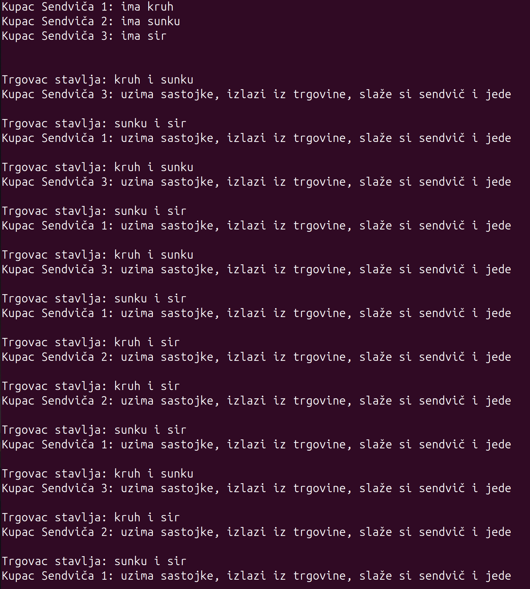
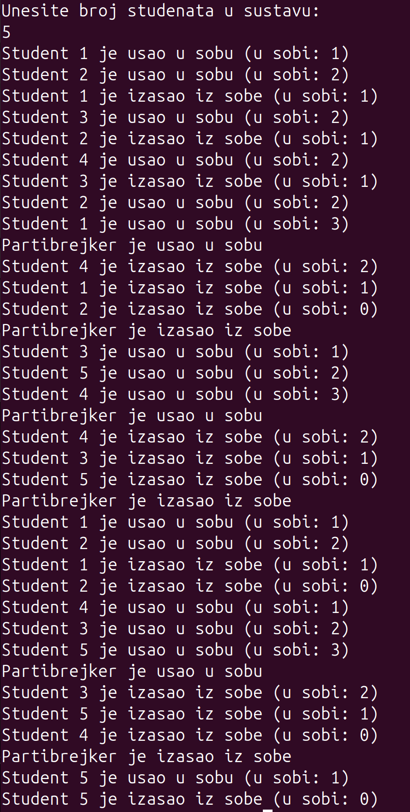
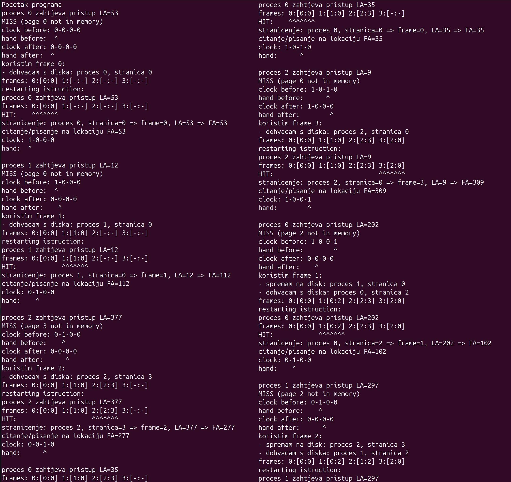

# OSLab — Operating Systems Lab Exercises

This repository contains my code solutions from the laboratory exercises in the course **Introduction to Operating Systems** at the Faculty of Electrical Engineering and Computing (FER), University of Zagreb.

All programs are written in **C** and are intended to be run on a **Linux operating system**.  
The code was developed and tested in **Ubuntu Linux running inside a VirtualBox virtual machine**.

---

## 📂 Project Structure

```
Lab1/
Lab2/
Lab3/
Lab4/
screenshots/
README.md
LICENSE
```

---

## 📖 Lab Descriptions

### **Lab 1 — Signals and Interrupts**
Managing signals and interrupts using software support with interrupt routines that handle priority management.

### **Lab 2 — MyShell**
Created a simple custom shell with basic features/commands like:
- `history`
- `cd`
- `ps`
- `!` (replays a command from history)
- `kill`

### **Lab 3 — Semaphores and Monitors**
Contains two assignments:
1. A problem similar to the *cigarette smokers problem*, implemented using **semaphores and processes**.  
2. The **PartyBreaker problem**, implemented using a **monitor and threads**.

### **Lab 4 — Paging Clock Algorithm**
Simulation of paging a large program using the **clock page replacement algorithm**.

---

## ⚙️ Building and Running (Linux)

### 1. Install build tools (if not already installed)

```bash
sudo apt update
sudo apt install build-essential
```

This installs `gcc`.

---

### 2. Navigate to a lab directory

```bash
cd Lab1
```

---

### 3. Build the program

```bash
gcc [insert_file_name]
```

---

### 4. Run the program

```bash
./a.out
```

---

## 🎯 What This Project Represents

Through these labs I gained hands-on experience with:

- processes, signals and interrupt handling  
- building a simple shell and working with processes  
- inter-process communication, semaphores and monitors  
- thread synchronization  
- virtual memory and paging algorithms  
- compiling C programs on Linux using `gcc` and `make`  

---

## 📸 Example Output (Screenshots)

### Lab 3a



### Lab 3b


### Lab 4


---

## 📜 Disclaimer

This project was created as part of the course **Introduction to Operating Systems** at the Faculty of Electrical Engineering and Computing (FER), University of Zagreb, in 2025.

The code is intended for educational purposes.

---

## 📄 License

This project is released under the MIT License.

